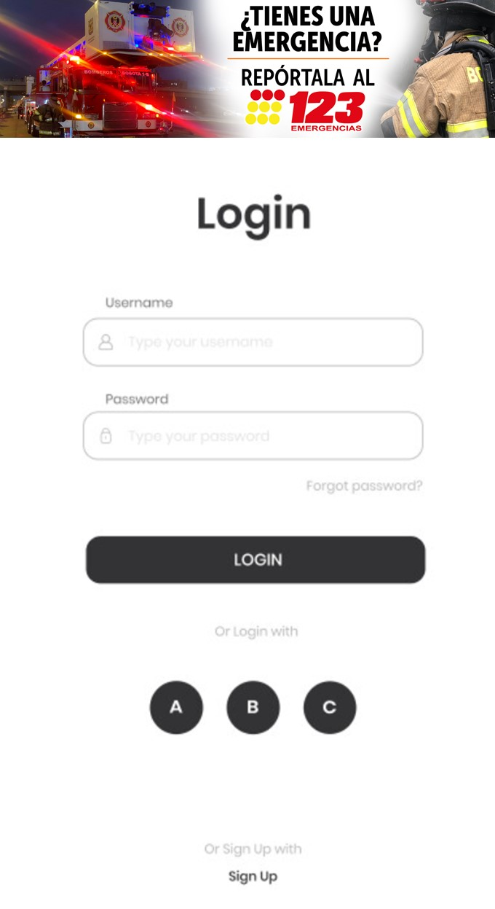
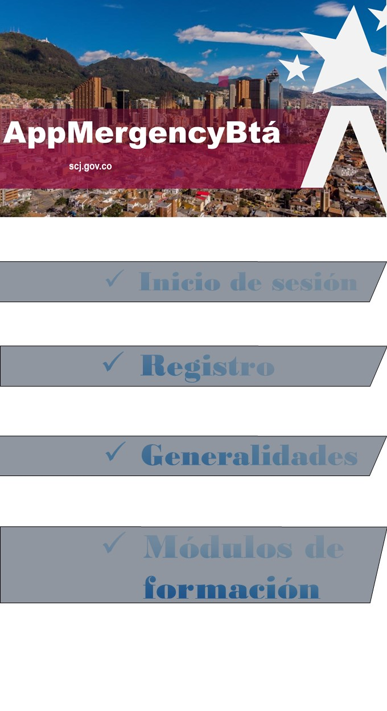
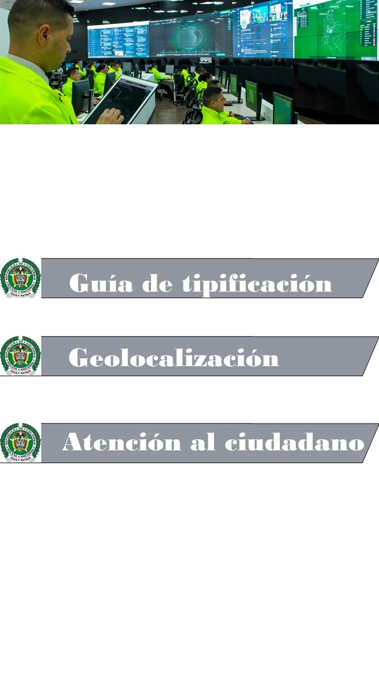
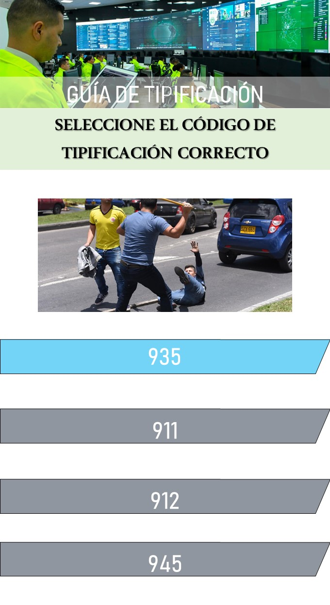
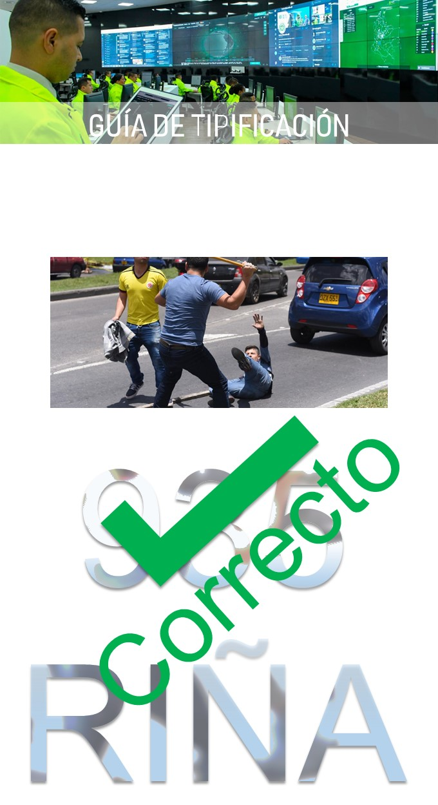
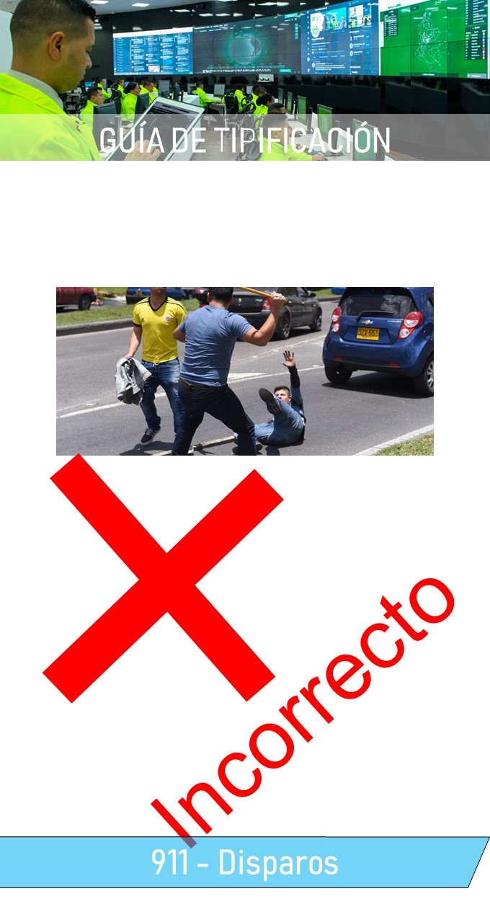

# Diseño de interfaz de usuario

La aplicación tendrá la siguientes pantallas

1. Pantalla 1: Login

2. Pantalla 2: Menus

3. Pantalla 3: Preguntas

4. Pantalla 4: Respuestas

# Referencias

- [Material Design: Foundations](https://m3.material.io/foundations)
- [Material Design: Style](https://m3.material.io/styles)
